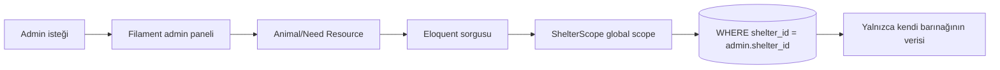
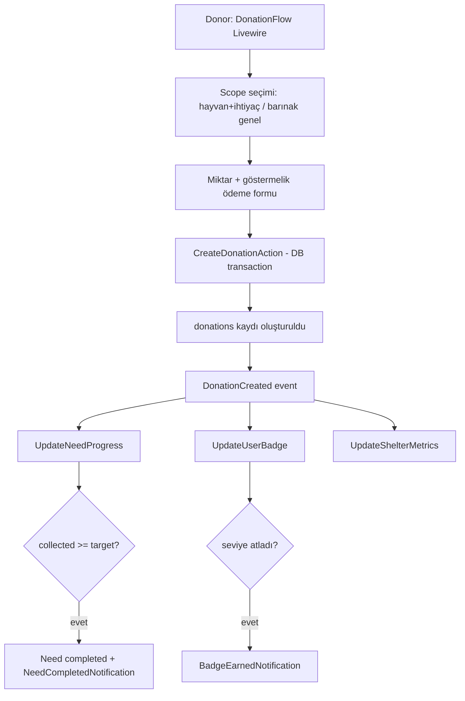
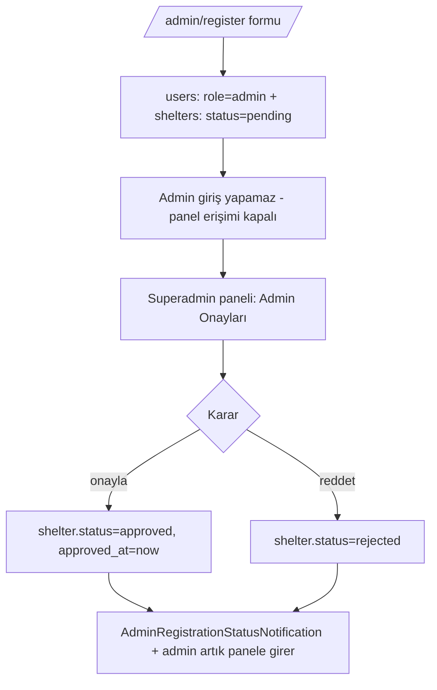

# 01 — Mimari

## 1. Katmanlı Mimari

```
┌─ Sunum (Presentation) ──────────────────────────────────────┐
│  Public  : Livewire 3 bileşenleri + Blade + Alpine + Tailwind │
│  Paneller: Filament 3 (admin paneli + superadmin paneli)      │
├─ Uygulama (Application) ────────────────────────────────────┤
│  Events / Listeners  : DonationCreated → 3 listener           │
│  Actions             : CreateDonationAction, ApproveShelter…  │
│  Form Requests / Rules / Notifications                        │
├─ Alan (Domain) ────────────────────────────────────────────┤
│  Eloquent Models + İlişkiler                                  │
│  Policies (yetkilendirme) + ShelterScope (multi-tenancy)      │
│  Enum sınıfları (Role, ShelterStatus, NeedType, …)            │
├─ Kalıcılık (Persistence) ──────────────────────────────────┤
│  Migrations + Seeders + Factories  ·  MySQL / MariaDB         │
└─────────────────────────────────────────────────────────────┘
```

**Sorumluluk dağılımı**
- **Livewire bileşenleri** yalnızca public (giriş gerektirmeyen veya donor) sayfaları yönetir.
- **Filament panelleri** tüm yönetim (admin + superadmin) işlemlerini yönetir.
- **Actions** sınıfları yeniden kullanılabilir iş operasyonlarını kapsüller (örn. bağış oluşturma hem Livewire'dan hem testten çağrılır).
- **Events/Listeners** yan etkileri (bildirim, cache, denormalize alan güncelleme) iş akışından ayırır.

## 2. Multi-Tenancy Stratejisi

**Yaklaşım:** Single Database, Shared Schema. `stancl/tenancy` paketi kullanılmaz —
bağımlılığı azaltmak için custom global scope.

- Tenant'a bağlı tablolar `shelter_id` kolonu taşır: `animals`, `needs`, `donations`, `announcements`.
- `App\Scopes\ShelterScope` global scope:
  - `auth()->user()?->role === 'admin'` → `where('shelter_id', $user->shelter->id)`
  - `superadmin` → scope bypass (tüm veri)
  - `user` / misafir → scope uygulanmaz (public veri, ayrıca `is_active` / `status` filtreleri)
- Scope, tenant modellerinin `booted()` metodunda `addGlobalScope` ile bağlanır.
- Filament admin paneli kaynaklarında scope otomatik devreye girer; superadmin panelinde
  `Model::withoutGlobalScope(ShelterScope::class)` ile bypass edilir.

```php
class ShelterScope implements Scope
{
    public function apply(Builder $builder, Model $model): void
    {
        $user = auth()->user();
        if ($user?->role === 'admin' && $user->shelter) {
            $builder->where($model->getTable().'.shelter_id', $user->shelter->id);
        }
    }
}
```

> **Önemli:** Public Livewire bileşenleri admin oturumu olmadan çalıştığından scope tetiklenmez.
> Bir admin aynı anda donor gibi davranıp başka barınağa bağış yaparsa: bağış akışı `shelter_id`'yi
> seçilen hayvan/barınaktan alır, scope'tan değil.

## 3. Kimlik Doğrulama & Paneller

- **User (donor) auth:** Laravel Breeze, Livewire stack. Login, register, şifre sıfırlama,
  email doğrulama hazır gelir.
- **Paneller:** Filament 3 multi-panel.
  - `/admin` → barınak yöneticisi paneli (tenant-scoped)
  - `/superadmin` → platform yöneticisi paneli (global)
- Panel erişimi `User::canAccessPanel(Panel $panel)` ile:
  - `admin` → yalnızca `admin` paneli **ve** `shelter.status === approved`
  - `superadmin` → yalnızca `superadmin` paneli
  - `user` → hiçbir panele erişemez
- Roller `users.role` enum kolonunda. Yetkilendirme Laravel Policy/Gate ile.

## 4. Para Birimi & Tutar Saklama

- Tutar alanları `decimal(12,2)`.
- `donations.currency` kolonu `char(3)`, default `TRY`. Faz 1 yalnızca TRY; çoklu para
  birimi şema seviyesinde hazır.
- Denormalize (cache) tutar alanları: `needs.collected_amount`, `users.total_donated`.

## 5. Bağış İş Mantığı (Event Chain)

`App\Actions\CreateDonationAction` bir veritabanı transaction'ı içinde `donations` kaydını
oluşturur ve `DonationCreated` event'ini fırlatır.

```
DonationCreated
  ├─→ UpdateNeedProgress
  │     collected_amount += amount
  │     collected >= target  →  status=completed, completed_at=now()
  │                          →  destekçilere NeedCompletedNotification
  ├─→ UpdateUserBadge
  │     total_donated yeniden hesapla
  │     badge_level güncelle
  │     seviye atladıysa  →  BadgeEarnedNotification
  └─→ UpdateShelterMetrics
        barınak dashboard cache'ini invalide et
```

Detaylı kurallar: [04-is-kurallari.md](04-is-kurallari.md).

## 6. Klasör Organizasyonu

`app/` altında projeye özel klasörler (standart Laravel klasörlerine ek):

```
app/
  Actions/        CreateDonationAction, ApproveShelterAction, RejectShelterAction
  Enums/          Role, ShelterStatus, AnimalSpecies, Gender, NeedType, NeedStatus
  Events/         DonationCreated
  Filament/       Resources/ (panel başına namespace), Pages/, Widgets/
  Listeners/      UpdateNeedProgress, UpdateUserBadge, UpdateShelterMetrics
  Livewire/       AnimalList, AnimalDetail, ShelterProfile, Leaderboard,
                  DonationFlow, UserProfile, NotificationCenter
  Models/         Shelter, User, Animal, Need, Donation, Badge, Announcement
  Notifications/  NeedCompletedNotification, BadgeEarnedNotification,
                  ShelterAnnouncementNotification, AdminRegistrationStatusNotification
  Policies/       ShelterPolicy, AnimalPolicy, NeedPolicy, DonationPolicy, AnnouncementPolicy
  Scopes/         ShelterScope
```

## 7. Akış Diyagramları

### 7.1 Admin Tenant-Scoped İstek



### 7.2 Bağış Akışı + Event Chain



### 7.3 Admin Kayıt → Superadmin Onay



## 8. Önemli İlkeler

- **Denormalize alanlar tek yoldan güncellenir:** `collected_amount`, `total_donated`,
  `badge_level` yalnızca ilgili listener içinde, transaction altında güncellenir.
- **Tamamlanan ihtiyaca bağış kabul edilmez:** `DonationFlow` ve `CreateDonationAction`
  `need.status === active` doğrulaması yapar.
- **Anonimlik yalnızca görünürlüktür:** Anonim bağışlar da `total_donated`'a ve leaderboard
  hesabına dahildir; sadece isim "Anonim Bağışçı" olarak gizlenir.
