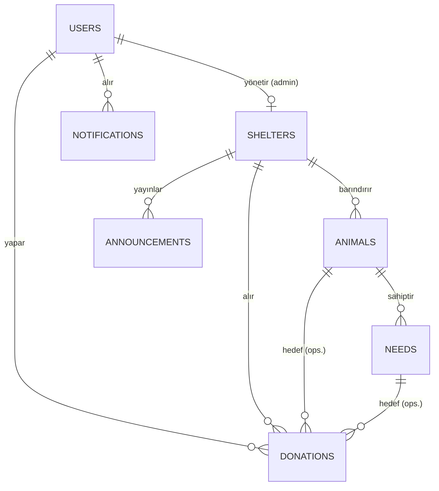

# 02 — Domain Model

Entity tanımları, ilişkiler ve enum'lar. Tablo/kolon ayrıntısı:
[03-DATABASE_SCHEMA.md](./03-DATABASE_SCHEMA.md).

---

## 1. Entity Listesi

| Entity | Rol | Tenant'a bağlı? |
|---|---|---|
| `User` | Kullanıcı (4 rol) | — |
| `Shelter` | Barınak (tenant kökü) | kendisi |
| `Animal` | Hayvan | ✅ `shelter_id` |
| `Need` | Hayvan ihtiyacı | ✅ `shelter_id` |
| `Donation` | Bağış kaydı | ✅ `shelter_id` |
| `Badge` | Rozet tanımı (statik) | — |
| `Announcement` | Barınak duyurusu | ✅ `shelter_id` |
| `Certificate` *(Faz 2)* | Bağış sertifikası | — |

---

## 2. İlişki Diyagramı

---

## 3. Entity Açıklamaları

### User
Platformun dört rolünü temsil eder: `superadmin`, `admin`, `user`, `veterinarian` (Faz 2).
- `admin` → bir `Shelter` ile birebir (`shelters.admin_user_id`).
- `user` → birden çok `Donation`.
- Denormalize alanlar: `total_donated`, `badge_level` (event chain günceller).

### Shelter
Tenant kökü. Her barınağın bir yöneten admin'i (`admin_user_id`) vardır.
- `status`: `pending` → `approved` / `rejected` / `suspended`.
- Yalnızca `approved` barınakların hayvanları public listelenir.

### Animal
Barınağa ait hayvan. `species`, `gender` enum; `is_active` ile yayın durumu.
Bir hayvanın birden çok `Need`'i olabilir.

### Need
Bir hayvanın spesifik ihtiyacı (`food` / `vaccine` / `illness`). Hedef tutar
(`target_amount`) ve denormalize `collected_amount` taşır. Hedefe ulaşınca
`status = completed`.

### Donation
Bir kullanıcının yaptığı bağış. İki geçerli scope:
- **Spesifik:** `animal_id` + `need_id` dolu.
- **Barınak genel:** `animal_id` + `need_id` NULL.

`is_anonymous` yalnızca görünürlüğü etkiler; rozet/leaderboard hesabına dahildir.

### Badge
Statik rozet tanımı (seed). `level` (1–5) ve `min_amount` eşiği.

### Announcement
Barınağın duyurusu. Yayınlandığında o barınağa bağış yapmış kullanıcılara bildirim gider.

### Certificate *(Faz 2)*
Her bağış için üretilen PDF sertifika. Bkz. [13-ROADMAP.md](./13-ROADMAP.md).

---

## 4. Enum'lar

`app/Enums/` altında PHP 8.3 backed enum olarak tanımlanır.

| Enum | Değerler |
|---|---|
| `Role` | `superadmin`, `admin`, `user`, `veterinarian` |
| `ShelterStatus` | `pending`, `approved`, `rejected`, `suspended` |
| `AnimalSpecies` | `cat`, `dog`, `kitten`, `puppy` |
| `Gender` | `male`, `female`, `unknown` |
| `NeedType` | `food`, `vaccine`, `illness` |
| `NeedStatus` | `active`, `completed`, `cancelled` |

Enum'lar kullanıcıya görünen Türkçe etiketi bir `label()` metoduyla döndürür
(örn. `NeedType::Food->label()` → "Mama").

---

**Sonraki:** [03-DATABASE_SCHEMA.md](./03-DATABASE_SCHEMA.md)
