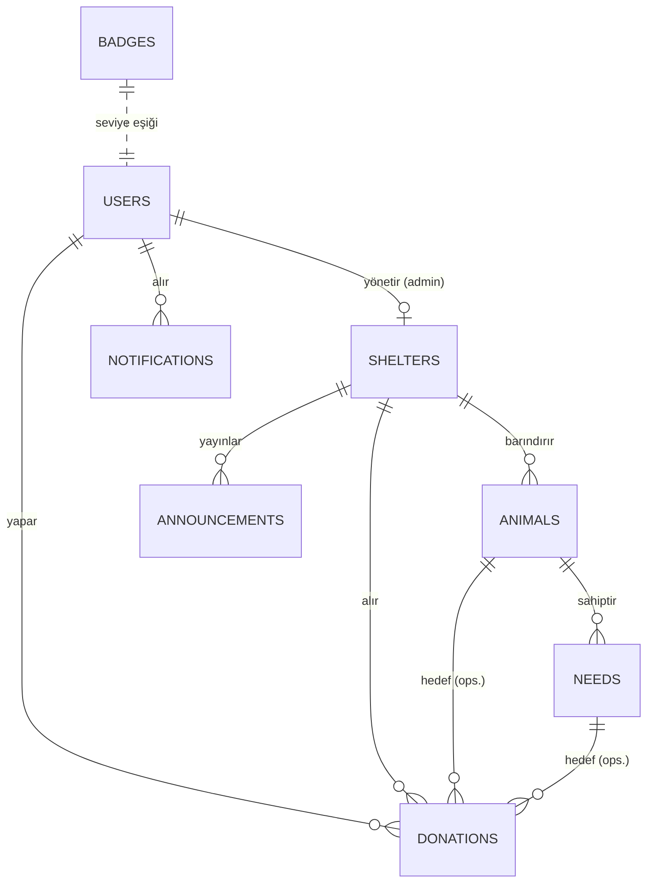

# 02 — Veri Modeli

Tüm tutar alanları `decimal(12,2)`. Tüm tablolar aksi belirtilmedikçe `created_at` /
`updated_at` taşır.

## ER Diyagramı

## 3.1 `shelters` — Barınaklar (Tenant)

| Alan | Tip | Açıklama |
|---|---|---|
| id | bigint PK | |
| admin_user_id | FK users | Barınağı yöneten admin |
| name | string | Barınak adı |
| license_no | string unique | Ruhsat numarası |
| city | string | Şehir (filtre için, index) |
| phone | string | İletişim telefonu |
| address | text | Açık adres |
| status | enum | `pending`, `approved`, `rejected`, `suspended` |
| approved_at | timestamp nullable | Superadmin onay tarihi |

## 3.2 `users`

| Alan | Tip | Açıklama |
|---|---|---|
| id | bigint PK | |
| name | string | Ad Soyad |
| email | string unique | |
| email_verified_at | timestamp nullable | Breeze |
| password | string | Hashed |
| role | enum | `superadmin`, `admin`, `user`, `veterinarian` |
| total_donated | decimal(12,2) | **Cache:** global toplam bağış |
| badge_level | tinyint default 0 | 0–5 (0 = rozet yok) |
| is_banned | boolean default false | Superadmin ban kontrolü |
| remember_token | string nullable | |

> `veterinarian` rolü Faz 2'de aktiftir; enum'da baştan tanımlanır.

## 3.3 `animals`

| Alan | Tip | Açıklama |
|---|---|---|
| id | bigint PK | |
| shelter_id | FK shelters | Tenant kolonu (index) |
| name | string | |
| species | enum | `cat`, `dog`, `kitten`, `puppy` |
| age_estimate | string | Örn. "2 yaş", "3 aylık" |
| gender | enum | `male`, `female`, `unknown` |
| story | text | Hikaye / açıklama |
| health_status | text | Sağlık durumu özeti |
| photo_path | string nullable | Tek fotoğraf (Faz 2'de galeri) |
| is_active | boolean default true | Profil yayında mı |

## 3.4 `needs` — Hayvan İhtiyaçları

| Alan | Tip | Açıklama |
|---|---|---|
| id | bigint PK | |
| animal_id | FK animals | (index) |
| shelter_id | FK shelters | Tenant kolonu — animal'dan denormalize, scope için |
| type | enum | `food`, `vaccine`, `illness` |
| title | string | Örn. "Pamuk için kuduz aşısı" |
| description | text nullable | |
| target_amount | decimal(12,2) | Hedef miktar |
| collected_amount | decimal(12,2) default 0 | **Cache:** toplanan miktar |
| status | enum | `active`, `completed`, `cancelled` |
| completed_at | timestamp nullable | Hedef dolunca otomatik |

> Bir hayvanın birden fazla `active` ihtiyacı olabilir.

## 3.5 `donations`

| Alan | Tip | Açıklama |
|---|---|---|
| id | bigint PK | |
| user_id | FK users | (index) |
| shelter_id | FK shelters | Hangi barınağa (cache, index) |
| animal_id | FK animals nullable | Barınak genel desteğinde NULL |
| need_id | FK needs nullable | Barınak genel desteğinde NULL |
| amount | decimal(12,2) | Bağış miktarı |
| currency | char(3) default 'TRY' | Faz 1 sabit TRY |
| is_anonymous | boolean default false | Leaderboard'da "Anonim Bağışçı" |
| payment_meta | json | Sahte ödeme — yalnızca kart son 4 hane. CVV asla saklanmaz |
| created_at | timestamp (index) | Bu ay / bu yıl sıralaması için kritik |

> **Scope kuralı:** Geçerli iki kombinasyon vardır:
> - `animal_id` + `need_id` dolu → spesifik ihtiyaca bağış
> - `animal_id` + `need_id` NULL → barınağa genel destek
>
> "Hayvana genel bağış" (animal dolu, need NULL) **desteklenmez**.

## 3.6 `badges` — Rozet Tanımları (seed)

| Alan | Tip | Açıklama |
|---|---|---|
| id | bigint PK | |
| level | tinyint unique | 1–5 |
| name | string | Rozet adı |
| min_amount | decimal(12,2) | Minimum toplam bağış eşiği |

Seed verisi (`BadgeSeeder`):

| level | min_amount | name |
|---|---|---|
| 1 | 50 | Bronz Patiseven |
| 2 | 500 | Gümüş Koruyucu |
| 3 | 5.000 | Altın Hami |
| 4 | 25.000 | Platin Yardımcı |
| 5 | 200.000 | Elmas Şampiyon |

## 3.7 `announcements` — Duyurular

| Alan | Tip | Açıklama |
|---|---|---|
| id | bigint PK | |
| shelter_id | FK shelters | Yayınlayan barınak |
| title | string | |
| body | text | |

> Duyuru oluşturulduğunda, o barınağa daha önce bağış yapmış (`donations.shelter_id = X`,
> distinct `user_id`) kullanıcılara `ShelterAnnouncementNotification` gönderilir.

## 3.8 `notifications` — Laravel Native

Laravel `DatabaseChannel` standart `notifications` tablosu. Bildirim tipleri:

| Notification | Tetikleyici | Alıcı |
|---|---|---|
| `NeedCompletedNotification` | Desteklenen ihtiyaç tamamlandı | İhtiyaca bağış yapanlar |
| `BadgeEarnedNotification` | Yeni rozet seviyesi | İlgili kullanıcı |
| `ShelterAnnouncementNotification` | Barınak duyuru yayınladı | Barınağın bağışçıları |
| `AdminRegistrationStatusNotification` | Admin onaylandı/reddedildi | İlgili admin |

## 3.9 `certificates` — Faz 2

| Alan | Tip | Açıklama |
|---|---|---|
| id | bigint PK | |
| user_id | FK users | |
| donation_id | FK donations | |
| pdf_path | string | Otomatik üretilen PDF yolu |
| veterinarian_id | FK users nullable | Onaylayan veteriner |

Detay: [08-faz-2.md](08-faz-2.md).

## İndeksler & Kısıtlar Özeti

- `shelters.license_no` → unique
- `users.email` → unique
- `donations` → index: `created_at`, `shelter_id`, `user_id`
- `animals.shelter_id`, `needs.shelter_id`, `needs.animal_id` → index
- Tüm FK'ler ilgili silme davranışıyla (`needs`/`animals` → cascade; `donations` → restrict,
  bağış geçmişi korunur).
